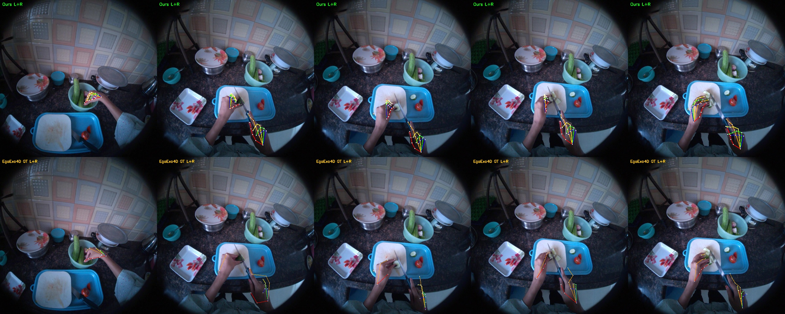
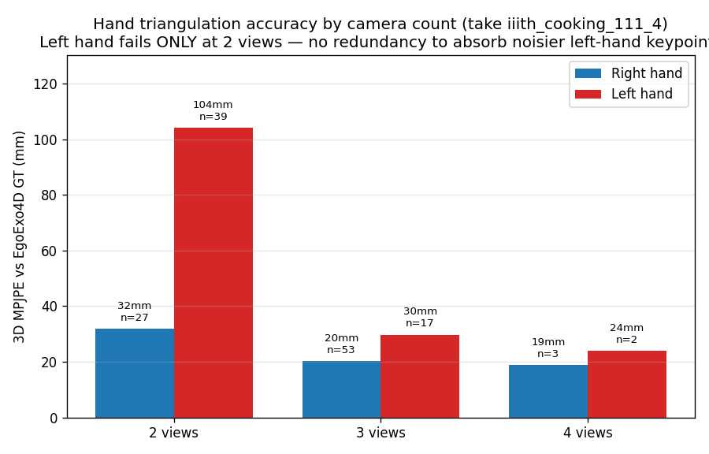
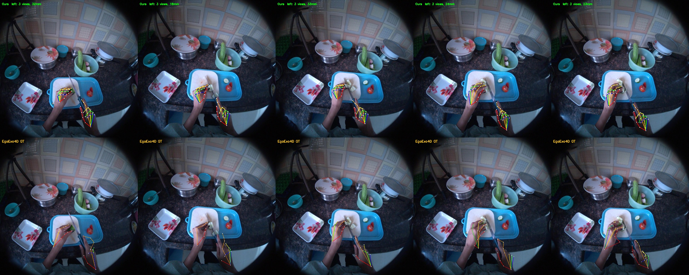

# trihands

Reproduction of the **multiview hand triangulation pipeline** (Algorithm 1, Supplementary B) from
*"What Matters When Cotraining Robot Manipulation Policies on Everyday Human Videos?"*
([arXiv:2606.06627](https://arxiv.org/abs/2606.06627), Li et al.).

The pipeline turns EgoExo4D multi-view RGB video (1 egocentric Aria camera + 4 exocentric GoPros,
all fisheye) into **3D hand keypoints**, reprojects them into the egocentric view (a **Figure-7
panel**), and is validated against EgoExo4D's released hand annotations.

## Status

| Stage | What it does | Status |
|---|---|---|
| 1 — Hand detection | YOLO bounding boxes per view | ✅ |
| 2 — Single-view WiLoR | 2D hand keypoints per view | ✅ |
| 3 — Multiview triangulation | ego-anchored correspondence + fisheye-unproject + DLT + IRLS/τ_c | ✅ |
| 4 — Temporal interpolation | fill gaps ≤12 frames (linear) | ✅ |
| — Temporal exo-fallback | recover ego-blind frames via exo tracking (extension) | ✅ |
| — Ego reprojection (Figure 7) | project 3D hand into the ego image, full video | ✅ |
| — Validation vs EgoExo4D GT | 3D MPJPE against released hand annotations | ✅ |
| 5 — IK → MANO mesh | (not needed for the keypoint panel) | skipped |

See [`algorithm.md`](algorithm.md) for the annotated algorithm + notation, and [`goal.md`](goal.md)
for the plan, findings, and build log.

## How it works (Stage 3 highlights)

- **Fisheye, not pinhole.** Exo cameras are KannalaBrandtK3, the ego Aria is FisheyeRadTanThinPrism.
  2D keypoints are unprojected to world-frame rays via `projectaria_tools`; DLT triangulates on rays.
- **Ego-anchored correspondence.** The ego view sees only the wearer, so it anchors which detections
  are the wearer's hands. Each exo detection is matched by **ray-ray distance** (resolution-independent):
  wearer's-hand rays intersect at ~0.5 cm, wrong-hand at ~10 cm, bystanders at ~22 cm — so noisy
  views, wrong hands, and bystanders are rejected automatically.
- **Robust triangulation.** IRLS Huber on ray-perpendicular residuals + τ_c view-drop.
- **Temporal exo-fallback.** When the ego loses a hand, its 3D is propagated from the last good frame,
  reprojected into the exo views, and re-triangulated exo-only — reclaiming the multi-view redundancy
  the strict ego anchor would otherwise discard (right-hand coverage 93% → 100% on the first take).

## Validation against EgoExo4D ground truth

EgoExo4D releases hand annotations for a subset of takes (74 of the cooking takes). Running the full
pipeline on `iiith_cooking_111_4` and comparing to those annotations:

| Comparison | 3D MPJPE |
|---|---|
| **Ours (multi-view triangulation) vs EgoExo4D GT** | **~24 mm** |
| Paper's Table 3: *monocular* HaWoR vs triangulation | 185.7 mm |

Our multi-view hands agree with EgoExo4D's GT **~8× tighter than a monocular estimate** — the paper's
core thesis (multi-view ≫ monocular).

**Figure 7 reproduced** — top row = our triangulated hands, bottom row = EgoExo4D's released GT, same
ego frames (both hands):

### Why the left hand is harder (a depth, not visibility, problem)

Per-hand the right hand is ~24 mm but the left is worse — **only at 2 views**:

The left hand is *visible*, and its 2D reprojection is as accurate as the right (~40 px); but at
**2 views there is no redundancy**, so depth is maximally sensitive to keypoint noise — and left-hand
keypoints are noisier (partially occluded holding the food; WiLoR is trained on right hands and mirrors
for left). With **≥3 views the left hand drops from ~80 mm to ~29 mm**, matching the right. Two fixes
follow directly: require ≥3 views, or improve left-hand 2D keypoints (e.g. a fine-tuned detector).

On the frames where the left hand has ≥3 views it reconstructs accurately (per-frame 18–33 mm, the
same range as the right hand) — the skeleton sits correctly on the left hand in both rows:

## Scripts

| Script | Role |
|---|---|
| `scripts/wilor_keypoints.py` | Stage 1–2: WiLoR detection + 2D keypoints per view (WiLoR env) |
| `scripts/triangulate_geom.py` | Stage 3 geometry: exo fisheye-unproject + ray-DLT |
| `scripts/reproject_ego.py` | moving ego (Aria) camera; reproject 3D into the ego view |
| `scripts/triangulate_unified.py` | triangulate from ego + exo together |
| `scripts/stage3_auto.py` | automatic Stage 3 (single frame): ego-anchor + robust triangulation |
| `scripts/stage3_video.py` | full-video pipeline → 3D-hand trajectory + Figure-7 video/grid |
| `scripts/stage3_tracked.py` | temporal exo-fallback (recover ego-blind frames) |
| `scripts/stage4_interpolate.py` | temporal interpolation of the 3D trajectory |
| `scripts/coverage_diag.py` | per-frame camera-coverage diagnostic plot |
| `scripts/compare_gt.py` | Figure-7 both rows: ours vs EgoExo4D GT (right hand) + MPJPE |
| `scripts/compare_gt_full.py` | full pipeline, both hands, vs GT |
| `scripts/analyze_views.py` | MPJPE-by-camera-count analysis (the chart above) |

## Data (not included)

This repo contains **only code, docs, and license-safe charts**. Not included (and `.gitignore`d):

- **EgoExo4D** video, calibration, annotations, and any rendered overlays of its frames — the license
  forbids redistribution. Download via the official
  [Ego-Exo4D downloader](https://docs.ego-exo4d-data.org/) with your own license.
- Extracted frames and keypoint caches (regenerable from the above).
- Model checkpoints (WiLoR / MANO) — see their respective repos.

`figures/` holds the source-paper figures (reference); `results/` holds the synthetic charts plus the
Figure-7 comparison overlays.
